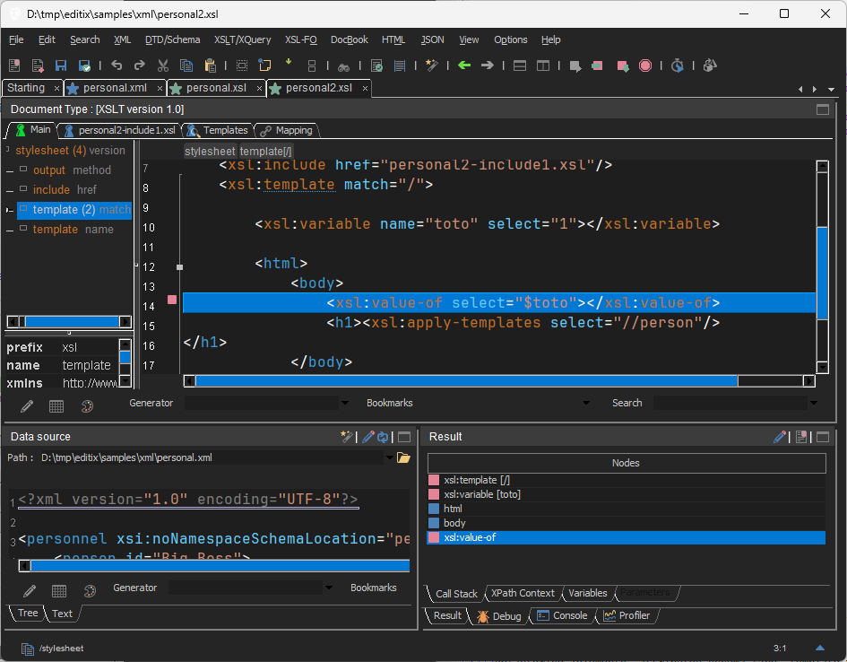
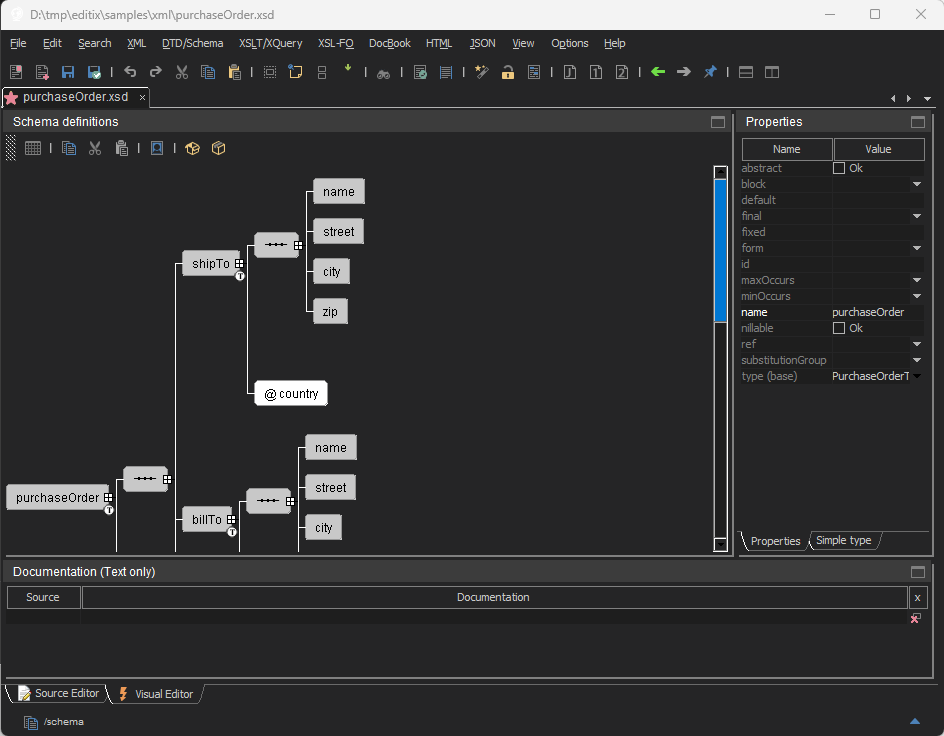

# NOTICE

# INTRODUCTION

[EditiX XML Editor](https://www.editix.com) is a powerful, open-source XML Editor : 

- Elegant, user-intuitive interface
- Smart on-the-fly syntax helper
- XSLT Editor and Debugger
- Visual W3C Schema Editor
- XML Project Management
- Complete XML Workflow

 

 


# LICENSES

## GPL 3

EditiX is licensed under the **[GPL-3.0](LICENSE)**.

## Commercial License

If you wish to use EditiX under a non-GPL license, [purchase a commercial license](https://www.editix.com).

# EXTENSION PACK

The Extension Pack is an optional package that includes:

- A complete manual with **more than 250 screenshots**
- English, French, Spanish and German translations of the manual
- **7 plugins** for using AI cloud providers directly inside EditiX:
  - Anthropic
  - Gemini
  - OpenAI
  - Ollama Cloud
  - DeepSeek
  - xAI
  - Mistral AI

You can purchase the Extension Pack at [https://www.editix.com](https://www.editix.com).

# INSTALLATION

This program requires Java 8 or later.

## Windows

Install git for your machine at [https://git-scm.com/install](https://git-scm.com/install)

Install a java jdk for your machine at [https://www.oracle.com/java/technologies/downloads](https://www.oracle.com/java/technologies/downloads)

Install ant (for compiling/running all) for your machine at [https://ant.apache.org/ivy/download.cgi](https://ant.apache.org/ivy/download.cgi)

Get the EditiX repository from the command line with

```bash
git clone https://github.com/AlexandreBrillant/Editix-xml-editor
```

Compile the EditiX XML Editor Source with 

```bash
ant compile
```

By default EditiX is compiled under Java 8, if you want another version (like Java 7), juste update the *build.xml* updating the *"source"* and *"target"* attributes (like 1.7) for the *javac* command.

Now you can run EditiX XML Editor with

```bash
ant run
```

Or using

```bash
run.bat
```

## Linux/Ubuntu

(You may replace 17 for the openjdk by 18,19...)

```bash
sudo apt install openjdk-17-jre
sudo apt install openjdk-17-jdk
sudo apt install ant
git clone https://github.com/AlexandreBrillant/Editix-xml-editor
ant compile
ant run
```

If you see the following error "java.awt.AWTError : Assistive Technology not found..." then edit
the /etc/java-8-openjdk/accessibility.properties (update 8 by your java version) and put a (#) comment for the line "assistive_technologies=..."

## Linux/Debian

[YouTube video from Renzo de Paoli](https://www.youtube.com/watch?v=pQA5nD2OGKM)


# CONTACT

For questions or support, contact me at : [https://www.editix.com](https://www.editix.com) or at
my professional web site : [https://www.alexandrebrillant.com](https://www.alexandrebrillant.com)

# AI Training Restriction

**This project's source code, documentation, and any associated data are strictly prohibited from being used to train, fine-tune, or develop artificial intelligence (AI) models, machine learning systems, or similar technologies.**
Violations of this restriction will result in the immediate termination of all rights granted under the project's license.

# Copyright

Copyright (c) 2026 Alexandre Brillant. All rights reserved.
